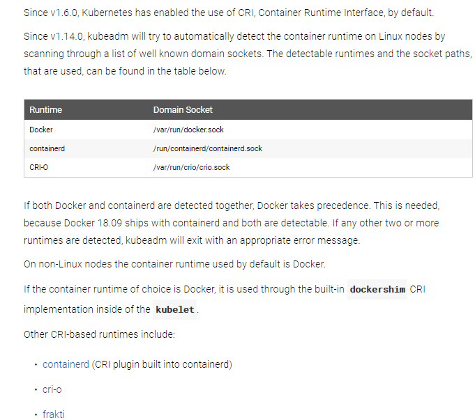

# 单机本地部署

@[TOC]
- 单机部署
    - [准备](#准备)
        - [特别注意的事项](#其它注意的事项)
    - [安装](#安装)
        - [安装kubeadm](#安装kubeadm)
            - [docker安装](#docker安装)
            - [安装kubeadm、kubelet、kubectl](#安装kubeadm、kubelet、kubectl)
    - [Init Master](#Init-Master)
        - [step 1](#step-1)
        - [step 2](#step-2)
        - [step 3](#step-3)
            - [CNI bridge](#CNI-bridge(非必须))
    - [Init Worker Node](#Init-Worker-Node)

- [自定义`kubeadm`配置](#自定义kubeadm配置)
- [二进制文件部署方式(暂未完善)](#二进制文件部署方式)
- [参考的文章](#参考的文章)

## 准备
系统要求
- ubuntu16.04+
- 2GB+ RAM per machine. Any less leaves little room for your apps.(can low than that)
- 2 CPU or more or more on the control-plane node
- Full network connectivity between all machines in the cluster (public or private network is fine)
- Unique hostname, MAC address, and product_uuid for every node.
    ```bash
      # 检查MAC address唯一性
      ifconfig -a
      # 检查product_uuid唯一性
      sudo cat /sys/class/dmi/id/product_uuid
    ```
- Certain ports are open on your machines.

- Swap disabled. You MUST disable swap in order for the `kubelet` to work properly
```bash
swapoff -a
```

### 其它注意的事项

**注意: 执行加入节点之前确保节点名称没有重复, 修改后需要重启**
- 对于master节点
    - 修改`/etc/hostname`将`ubuntu`修改成`ubuntu-master`
    - 修改`/etc/hosts`将`127.0.1.1  ubuntu`修改成`127.0.1.1  ubuntu-master`
- 同理, 对worker node节点做同样修改, 名称可随意(如: ubuntu-node-1)


## 安装
### 安装kubeadm
如果已经安装则`apt-get update && apt-get upgrade kubeadm`更新kubeadm. [跳至](#Init-Master) 

kubernetes作为容器管理工具, 最好先安装所需容器服务, 这里选择docker
#### docker安装
从v1.14.0开始, k8s会自动扫描下图中的地址以选择一个Container Runtime(默认是docker)作为k8s的container runtime interface.
如果没有, 则可按照[CRI Installation instructions](https://kubernetes.io/docs/setup/cri/)安装.


[docker安装脚本](../../doc/kubernetes/install/docker.sh)

#### 安装kubeadm、kubelet、kubectl
- kubeadm: 初始化集群的指令
- kubelet: 在集群中的每个节点上用来启动pod和container等
- kubectl: 集群通信的命令行工具

**注意: kubelet版本不可超过API server版本**

**需要翻墙, 如果没有网路环境的话, 考虑做成一个docker镜像进行部署或[二进制文件部署](#二进制文件部署方式)**
```bash
apt-get update
apt-get install -y apt-transport-https curl
# 如果出现gpg: no valid OpenPGP data found错误. 是因为需要翻墙下载apt-key.gpg. 
# 可选择访问https://packages.cloud.google.com/apt/doc/apt-key.gpg手动下载gpg文件. 地址: doc/kubernetes/files下
# 再执行apt-key add apt-key.gpg
curl -s https://packages.cloud.google.com/apt/doc/apt-key.gpg | apt-key add -
cat <<EOF >/etc/apt/sources.list.d/kubernetes.list
deb https://apt.kubernetes.io/ kubernetes-xenial main
EOF
apt-get update
apt-get install -y kubelet kubeadm kubectl
apt-mark hold kubelet kubeadm kubectl
```

```bash
# 重启kubelet
systemctl daemon-reload
systemctl restart kubelet
systemctl status kubelet
```

## Init Master
Master节点内包含etcd(集群的数据库)和API server

使用`kubeadm -h`查看帮助, 会给出创建k8s集群的example use.


### step 1
`kubeadm init`首先会执行一系列的运行前检查来确保机器满足运行k8s的条件(碰到错误会终止整个初始化进程). 然后会下载并安装
集群的控制面组件. [具体执行内容](#kubeadm-init-执行内容)

执行以下命令
```bash
# 查看所需镜像
kubeadm config images list
# 测试与gcr.io的连接, 是否能成功拉取镜像
kubeadm config images pull
# 运行init, 初始化master
kubeadm init <args>
```


### step 2
请备份好打印出的`kubeadm join`命令, 用于节点加入集群. 可使用`kubeadm token`进行相关令牌操作
```bash
kubeadm join 192.168.80.129:6443 --token ydd6fb.sei7y7bhoxha6elw \
    --discovery-token-ca-cert-hash sha256:7c39d2fb1bb259b384129e951d5c0c7bb2b1dae340ddd7d0de272bfa2fa6ef2f
```


- ~~(可选)让普通用户可以运行kubectl~~
    ```bash
    mkdir -p $HOME/.kube
    sudo cp -i /etc/kubernetes/admin.conf $HOME/.kube/config
    sudo chown $(id -u):$(id -g) $HOME/.kube/config
    ```
- 因为我使用`root`用户, 则直接运行以下命令(其他节点中需要从master节点将admin.conf拷贝同目录下)
    ```bash
    export KUBECONFIG=/etc/kubernetes/admin.conf
    # 或者
    echo "export KUBECONFIG=/etc/kubernetes/admin.conf" >> ~/.bashrc
    source ~/.bashrc
    ```
### step 3
去[这里](https://kubernetes.io/docs/concepts/cluster-administration/addons/)选择插件, 
[安装插件命令](https://kubernetes.io/docs/setup/independent/create-cluster-kubeadm/#pod-network)

~~choose a pod network add-on: 必须先安装Pod网络插件, 以便Pod之间可以互相通信.~~
[策略插件](https://kubernetes.io/docs/setup/independent/create-cluster-kubeadm/)
- 群里面说推荐使用选择[Calico](https://docs.projectcalico.org/v3.7/getting-started/kubernetes/),
[install Calico for policy](https://docs.projectcalico.org/v3.7/getting-started/kubernetes/installation/calico)
- 这里我选择Weave Net作为Network解决方案: Weave Net 官方[安装向导](https://www.weave.works/docs/net/latest/kubernetes/kube-addon/)
    - Weave Net需要依赖一些CNI 插件. 按照以下了解
        - [CNI plugins](#CNI-bridge(非必须)) 
    - 安装Weave Net, 注意要符合kubectl的版本(这里使用v1.14.0)
        - 设置`sysctl net.bridge.bridge-nf-call-iptables=1` to pass bridged IPv4 traffic to iptables chains
        - 使用以下命令安装网络插件
        ```bash
        # 格式
        kubectl apply -f <add-on.yaml>
        # 这里使用官方文件安装网络策略
        kubectl apply -f "https://cloud.weave.works/k8s/net?k8s-version=$(kubectl version | base64 | tr -d '\n')"
        # check CoreDNS pod is Running
        kubectl get pods --all-namespaces
        ```   
    
~~由于一些安全因素, 默认情况下集群不会在Master节点上运行schedule pods. 如果选择在Master node上开启则使用以下命令~~
```bash
# 生产环境中最好不要设置该项
kubectl taint nodes --all node-role.kubernetes.io/master-
```

#### CNI bridge(非必须)
[kubernetes CNI network install](https://kubernetes.io/docs/concepts/extend-kubernetes/compute-storage-net/network-plugins)
- 配置选项
    - 选择CNI 插件`--network-plugin=cni`
    - kubelet读取配置文件`--cni-conf-dir`(默认是`/etc/cni/net.d`)并配置至每个pod的network. 
    CNI配置必须符合[CNI 规范](https://github.com/containernetworking/cni/blob/master/SPEC.md#network-configuration)
    - 所有CNI配置依赖的插件必须置入`--cni-bin-dir`(默认是`/opt/cni/bin`)中


**注意: 同一个集群内只能选择同一种Pod网络策略, 而[`CNI-Genie`](https://github.com/Huawei-PaaS/CNI-Genie)
可以使得kubernetes可以安装多个CNI 插件. 比如(注意需要先安装所需的插件, 如Weave-Net):**
- Assign multi-IP to pod from multi network solutions eg: 1 IP from Weave, 2nd from "Canal"
    ```bash
    # pod-multi.yaml
    apiVersion: v1.14.0
    king: Pod
    metadata:
        name: nginx-multi
        labels:
            app: web
        annotations:
            cni: "weave,canal"
    spec:
        containers:
            - name: key-value-store
                image: nginx:latest
                imagePullPolicy: IfNotPresent
                ports:
                    - containerPort: 6379
    ```
    - 根据配置启用Nginx pod并查看结果
    ```bash
    # 启用Nginx pod
    kubectl apply -f pod-multi.yaml
    # 查看所有pod对象IP信息
    kubectl get pods -o wide
    # 进入指定容器查看(pod-multi.yaml配置的nginx-multi容器服务)
    kubectl exec -ti nginx-multi sh
    #
    #
    ip a
    ```
- Assign IP to pod from ideal network soltuion on the node(eg: say user doesn't select a network solution, 
CNI-Genie picks the ideal solution that has less load)
    ```bash
    # pod-nocni.yaml
    apiVersion: v1
    kind: Pod
    metadata:
      name: nginx-nocni-master
      labels:
          app: web
      annotations:
          cni: ""
    spec:
      containers:
          - name: key-value-store
            image: nginx:latest
            imagePullPolicy: IfNotPresent
            ports:
              - containerPort: 6379
    ```
- new pod got an ip from Canal this time
  
 

## Init Worker Node
此步骤可以重复多次以实现work node节点扩容

- [安装docker](#docker安装)
- [安装k8s](#安装kubeadm、kubelet、kubectl)
- `kubeadm join`加入集群
    ```bash
    kubeadm join 192.168.80.129:6443 --token 7hoyka.cdxvv7ildg6tb472 \
        --discovery-token-ca-cert-hash sha256:bea2d7550302e3ac1ca7c8a13ae652f4d777f864f5db3931db857956e80d6b5b
    # 检查节点是否成功加入集群
    kubectl --kubeconfig admin.conf get nodes
    ```
- 如果需要在worker node上使用`kubectl`命令进行一些操作
    - 将Master节点上的`/etc/kubernetes/admin.conf`拷贝至worker node 节点上
    ```bash
    # 使用命令查询节点信息
    kubectl --kubeconfig admin.conf get nodes
    # 或者将admin.conf置入`/etc/kubernetes/admin.conf`下, 即可跟Master一样操作
    kubectl get nodes
    ```


## 自定义kubeadm配置
[官方文档](https://kubernetes.io/docs/setup/independent/control-plane-flags/)


## 二进制文件部署方式
- 下载二进制文件, 注意选择系统合适的(这里我选的是amd64的二进制), [下载地址](https://kubernetes.io/docs/setup/release/notes/#server-binaries)
    - [kubernetes binaries](files/kubernetes.tar)
    - server binaries: 下载`kubernetes-server-linux-amd64.tar` server binaries包含了所有k8s所需的组件, 无需单独
    下载Client binaries等组件
    - node binaries
    - client binaries
```bash
# 解压文件
tar -xvf kubernetes.tar
tar -xvf kubernetes-server-linux-amd64.tar
```

#### Installing kubeadm, kubelet and kubectl
由于使用apt-get install的方式需要翻墙, 因此使用下载的二进制文件进行安装.

将server binaries解压后的的组件置入/usr/local/bin中, 需放入的有:
- Master节点:
    - kube-apiserver
    - kube-controller-manager
    - kube-scheduler
    - etcd
    ```bash
      apt-get -y install etcd
      systemctl enable etcd
      systemctl start etcd
    ```
    - kubeadm
- node节点
    - docker
    - kubelet
    - kube-proxy
    
当使用命令`kubeadm init <args>`初始化时, 由于kubeadm init时需要翻墙, 因此提供了离线方式. 需要事先拉取以下镜像


可使用以下命令拉取镜像
```bash
kubeadm config images list
kubeadm config images pull
```

### Creating a single master cluster with kubeadm
kubeadm能帮助创建一个小型的符合最佳实践的kubernetes集群.[中文文档](https://kubernetes.io/zh/docs/setup/independent/create-cluster-kubeadm/)
- [kubeadm 参数](https://kubernetes.io/zh/docs/reference/setup-tools/kubeadm/kubeadm/)、
- [kubeadm init启动配置](https://kubernetes.io/docs/reference/setup-tools/kubeadm/kubeadm-init/#config-file)

使用`kubeadm -h`查看帮助, 会给出创建k8s集群的example use.


`kubeadm init`首先会执行一系列的运行前检查来确保机器满足运行k8s的条件(碰到错误会终止整个初始化进程). 然后会下载并安装
集群的控制面组件


## kubeadm init 执行内容

可用`kubeadm init -h`查看init命令执行了哪些具体步骤(有些步骤我省略了, 
[详情](https://kubernetes.io/docs/reference/setup-tools/kubeadm/kubeadm-init/#config-file))
- part1:
    - 做出变更之前会进行一系列的检查, 遇到错误则会终止init进程.(`--ignore-preflight-errors=<list-of-errors`> 
    加入参数忽略某些错误)
    - 生成一个自签名的CA证书, (或使用现有的通过`--cert-dir`指定, 默认路径`/etc/kubernetes/pki`), 
    为集群中每一个组件建立身份标识
    - 将kubeconfig文件写入`/etc/kubernetes/`目录以便kubelet、controller-manager 和 scheduler 用来连接到 API server.
    同时生成一个名为admin.conf的独立kubeconfig文件用于管理操作.
    - 为API server、controller manager和scheduler生成静态Pod文件.假如没有提供外部的etcd服务, 也会为etcd生成静态Pod文件
    (静态Pod文件在`/etc/kubernetes/manifests`目录下, kubelet会监视这个目录以便在系统启动的时候创建Pods)
- part2:   
    - 应用labels和taints, 使得master节点不会运行其他负载
    - 生成令牌以供其他节点加入master 可通过`--token`提供自己的令牌(可选).
    ```bash
      # 随机生成一个token
      kubeadm token generate
      # 具体规则使用kubeadm init -h 查看 
      kubeadm init --token "123456.1234567890123456" --token-ttl 2m
    ```
    - 为了使得节点能够遵循[Bootstrap Tokens](https://kubernetes.io/docs/reference/access-authn-authz/bootstrap-tokens/)
    和[TLS Bootstrap](https://kubernetes.io/docs/reference/command-line-tools-reference/kubelet-tls-bootstrapping/)
    加入集群, kubeadm会执行所有的必要配置:
        - 创建一份 ConfigMap 提供添加集群节点所需的信息,并为该 ConfigMap 设置相关的 RBAC 访问规
        - 使得 Bootstrap Tokens 可以访问 CSR 签名 API
        - 对新的 CSR 请求配置为自动签发
- part3: [kubeadm join](https://kubernetes.io/docs/reference/setup-tools/kubeadm/kubeadm-join/)
    - 通过 API server 安装一个 DNS 服务器(CoreDNS)和 kube-proxy 附加组件
- part4: 通过配置文件来使用kubeadm init(处于alpha版本, 古不使用). 可通过`--config`指定
    - `kubeadm config print init-defaults`查看默认配置. [具体字段说明](https://godoc.org/k8s.io/kubernetes/cmd/kubeadm/app/apis/kubeadm/v1beta1)
        - [`kube-proxy`说明](https://godoc.org/k8s.io/kubernetes/pkg/proxy/apis/config#KubeProxyConfiguration)
        - [IPVS](https://github.com/kubernetes/kubernetes/blob/master/pkg/proxy/ipvs/README.md): 基于虚拟ip的负载均衡, 我们不需要使用该技术
    - 使用自定义镜像: 
        - 默认情况下kubeadm会从`k8s.gcr.io`仓库(如果是持续集成版则为`gcr.io/kubernetes-ci-images`)拉取镜像
        - 使用配置文件的方式改变镜像拉取策略, 允许的自定义功能为:
            - 提供替代的镜像仓库替代`k8s.gcr.io`: 修改`imageRepository: "k8s.gcr.io"`
            - 提供指定的etcd.imgae
            - 注意统一使用指定版本的镜像
    - 集群使用内网IP
        - 运行init命令时, 为API server指定一个内网IP作为监听地址
        ```bash
          kubeadm init --apiserver-advertise-address=<private-master-ip>
        ```
        - 当master或者worker节点可供使用时, 向`/etc/systemd/system/kubelet.service.d/10-kubeadm.conf`添加
        一个标记指明worker的私有IP
        ```bash
          --node-ip=<private-node-ip>
        ```
        - 最后worker节点`kubeadm join`时, 使用正确的API server所在地址(第一步设置的)


## 参考的文章
- [kubeadm国内部署-Ubuntu16.04](https://blog.csdn.net/u010827484/article/details/83025404)